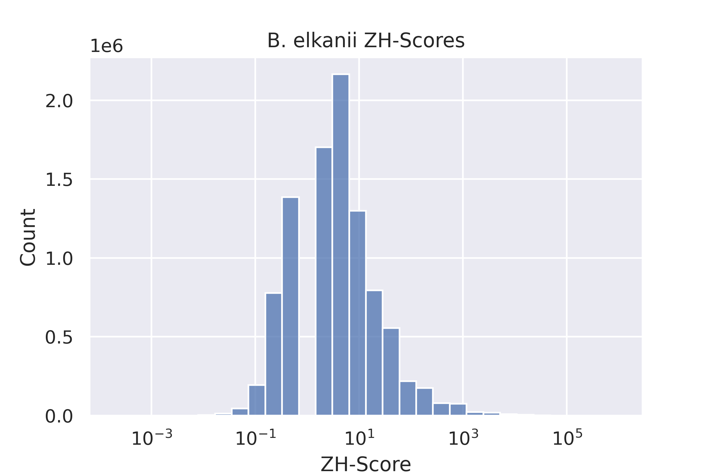
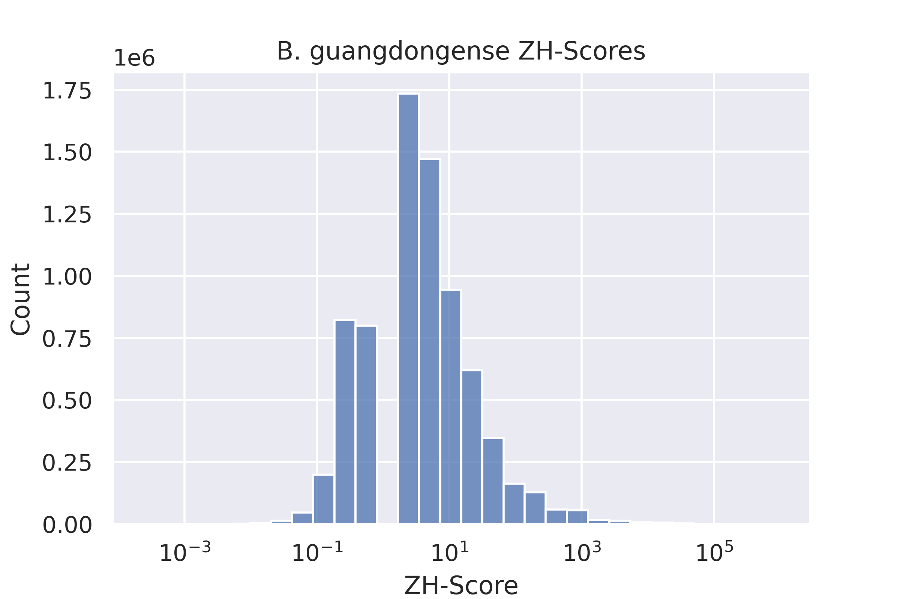
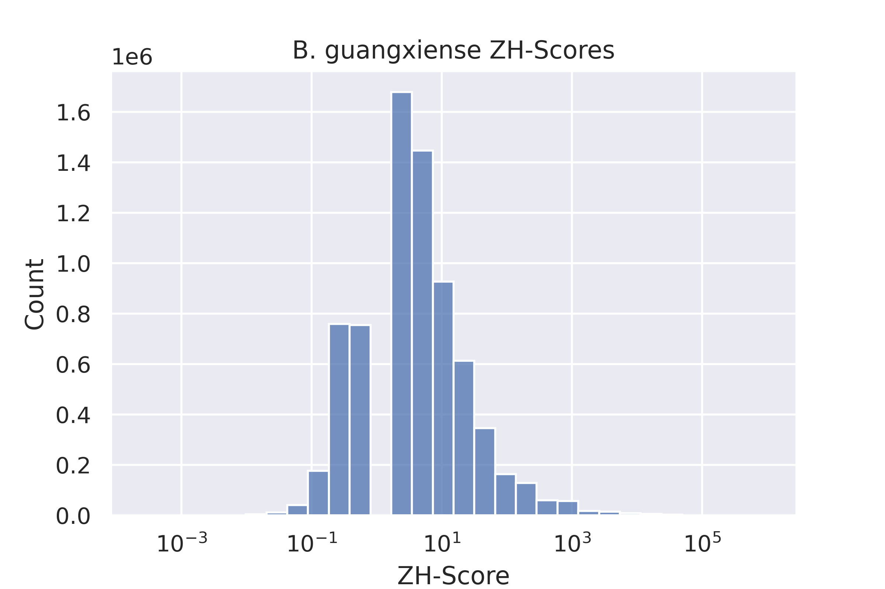

# bradyrhizobium
# hse22_project
Для анализа был выбран таксон Gammaproteobacteria, род Bradyrhizobeum.

[Ссылка на colab](https://colab.research.google.com/drive/1LF5wrfa9TW6ynDy_8dW5y0z_xeDYcvB6?usp=sharing)

# Общая информация
*Bradyrhizobium diazoefficiens*
*Bradyrhizobium elkanii* 
*Bradyrhizobium guangdongense* 
*Bradyrhizobium guangxiense* 
*Bradyrhizobium guangzhouense* 
# overview table

| Species  |  Genes number | Genome coverage | Genome length |
|---|--|--|---|
| B_diazoefficiens | 8330.00 |  85.96 | 8910608.00 | 
| B_elkanii  | 9139.00 | 84.34  | 9548186.00 |
| B_guangdongense  | 7092.00  | 87.58 | 7456045.00 |
| B_guangxiense  | 6876.00 | 88.01 | 7220948.00 |
| B_guangzhouense | 6754.00 | 88.19 | 7158886.00 |

# Number of Z-DNA regions and Z-DNA length

| Species  |  B_diazoefficiens | B_elkanii | B_guangdongense |  B_guangxiense | B_guangzhouense |
|---|--|--|---|--|---|
| Number of Z-DNA regions| 8910608 | 9548186 | 7456045 | 7220948 | 7158886 | 
| Z-DNA length  | 13611812 | 14572058  | 11387723 | 11029431 | 10930491 |


# Гистограмма значений zh-score
|   |   |
|---|---|
|  |   |
|   |   |
|   |   |

**Расположение Z - ДНК в промотерах**


## Multiple protein alignmentМножественно белковое выравнивание
Files are in the folder *aligment*, one of aligned sequences is provided here

<details>
<summary>Выравнивание для кластера №1</summary>

```

WP_011085642.1      MSKANLLDRRQVVSTLLADRKDVVAIGGLGASTNDICAAGDHARNFYLWGGMGGAAMIGL
WP_128953029.1      MSKANLLDRRQVVSALLADRKDVVAIGGLGASTNDITAAGDHARNFYLWGGMGGAAMIGL
WP_128924455.1      MSKANLLDRRQVVSTLLAHRKDAVAIGGLGASTNDMCAAGDHARNFYLWGGMGGAAMIGL
WP_128967513.1      MSKANLLDRRQVVSALLANRKDVVAIGGLGASTNDITAAGDHARNFYLWGGMGGAAMIGL
WP_016842925.1      MSKANLLDRRAVVAELLKDRKGAFAVGGLGASTYDIAAAGDHDRNFYLWGGMGGAVMIGL
                    ********** **: ** .**...*:******* *: ***** ************.****

WP_011085642.1      GLALAQPKLPVLVITGDGEMLMGMGSLATIGLQKPSNLSIVVLDNEAYGETGGQTSHTSA
WP_128953029.1      GLALAQPKLPVLVITGDGEMLMGMGSLATIGLQKPSNLSIVVLDNEAYGETGGQTSHTSA
WP_128924455.1      GLALAQPKLPVLVITGDGEMLMGMGSLATIGLQKPSNLSIAVLDNEAYGETGGQTSHTST
WP_128967513.1      GLALAQPTLPVLVITGDGEMLMGMGSLATIGLQKPANLSIAVLDNEAYGETGGQTSHTSA
WP_016842925.1      GLALAQPTLPVVVITGDGEMLMGMGSLATVGLQQPKNLSIIVLDNEAYGETGGQASHTGG
                    *******.***:*****************:***:* **** *************:***. 

WP_011085642.1      AADLVGVARACGIGDARAISTMAEVEAFAKAVHDVSAGPRFANVKIDSASLERILPSRDG
WP_128953029.1      AADLVGVARACGIADSRAISTMAEVEAFAKAVHDLSAGPRFANVKIDSANVERILPSRDG
WP_128924455.1      AADLVGVAKACGIKDSRAVTTMAEVEAFAKAVHDVSAGPRFANVKIDSAGLERILPTRDG
WP_128967513.1      AADLVGVARACGIKDSRAISTMAEVEAFAKAVHDLTAGPRFASVKIDSANLERILPTRDG
WP_016842925.1      TADLVGVAKACGIGDSRAISTMAEVEAFASSLQDVTAGPRFASAKIDGANLERVLSSRDG
                    :*******:**** *:**::*********.:::*::******..***.*.:**:*.:***

WP_011085642.1      TYIVNRIRGDLGFQPI
WP_128953029.1      TFIVNRIRGDLGFRPI
WP_128924455.1      TYILNRIRGDLGFQPI
WP_128967513.1      TYILNRIRGDLGFQPI
WP_016842925.1      TYLVNRIRGSIGHTPI
                    *:::*****.:*. **

```
 
</details>

## Визуализация расположения Z - ДНК для кластеров


# Предсказание G-квадруплексов

## G квадруплексы в промотерах

## Множественно белковое выравнивание
Файлы до Clustal и после приведены в папке *G aligment*

 
## Визуализация расположения G для кластеров

